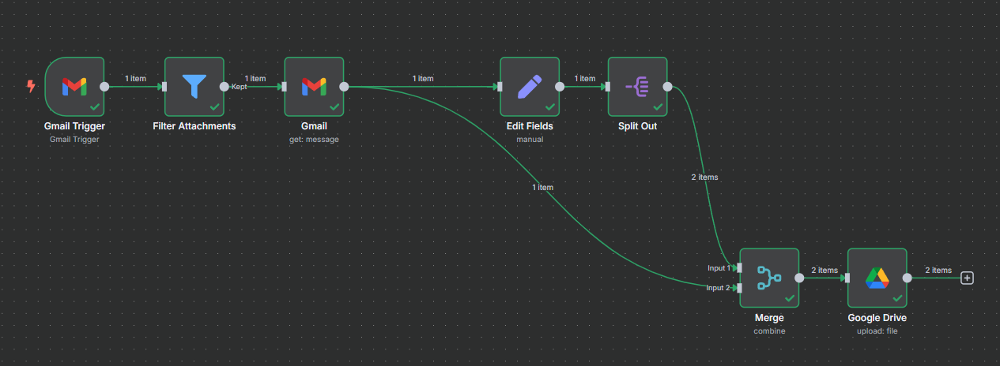

# 📥 Gmail Attachments to Google Drive – n8n Workflow

This n8n workflow automatically extracts email attachments from Gmail and uploads them to Google Drive. It’s useful for automating document collection, invoice storage, or any workflow involving email file handling.

---

## 🔧 Tools Used

- [n8n](https://n8n.io/) – workflow automation
- Gmail API, Google Drive API

---

## 🔄 Workflow Steps

1. **Gmail Trigger**
Watches your Gmail inbox and triggers when a new email arrives.

2. **Filter Attachments**
Filters out emails that don’t contain any attachments.

3. **Gmail: Get Message**
Retrieves the full content of the email, including metadata and attachments.

4. **Edit Fields**
- Extracts all attachment keys from the email’s binary data.
- Stores the `message_id` for later use.
`attachments: {{ Object.values($('Gmail Trigger').item.binary.keys()) }}`

`message_id: {{ $json.id }}`

5. **Split Out**
Splits the `attachments` array into individual items, one per file. This prepares each file to be processed independently.

6. **Merge (Combine Each Input)**
Combines:
- Each individual attachment item (from Split Out)
- With the full email metadata (from Gmail: Get Message)
Ensures every file has full context: `message_id`, `subject`, sender, etc.

7. **Google Drive: Upload File**
Uploads each attachment to your Google Drive with metadata included.

---

## 📦 Use Cases

- Archiving invoices or contracts from email

- Backing up attached files to the cloud

- Automating data collection from forms or reports sent by email

---

## 🖼️ Visual Overview

---

## 🛠 Requirements

- n8n instance

- Connected Gmail and Google Drive credentials

--- 

## 🔐 Notes

- Make sure the Gmail account has access to emails with attachments.

- Set up appropriate folder paths or naming conventions in the Google Drive node for better organization.

### 📄 Download or View the Workflow

👉 [Click here to view `workflow.json`](./workflow.json)

You can import this file directly into your n8n instance.